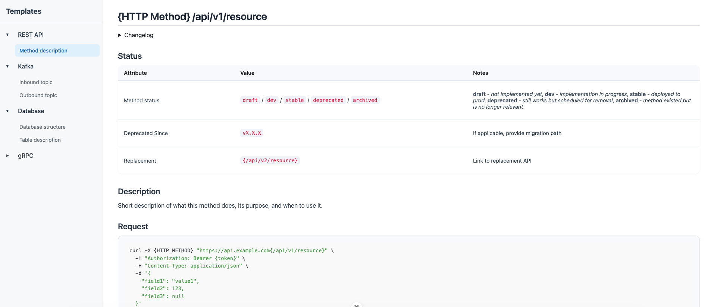

# System Analyst Templates

[](https://vuejs.org/)
[](https://vitejs.dev/)

A collection of ready-to-use AsciiDoc documentation templates for system analysts. Built with Vue 3 and Vite for a more beautiful presentation.
You can check raw asciidoc files [here](./public/content/).



## Purpose

This collection of templates is designed to present the most critical information clearly and unambiguously — ensuring that the documentation is equally understandable for both developers and business stakeholders.

## Created templates

| Template | Description |
|----------|-------------|
| **[Database](./public/content/database.adoc)** | ERD + full table specification with constraints and relationships |
| **[REST API Method](./public/content/rest-api-method.adoc)** | Complete method template with cURL examples, validation rules, error handling and business logic |
| **[gRPC Method](./public/content/grpc-method.adoc)** | Minimalistic template with request example, status codes and streaming support |
| **[Kafka Topic (Inbound)](./public/content/inbound-topic.adoc)** | Inbound topic description for consumer service |
| **[Kafka Topic (Outbound)](./public/content/outbound-topic.adoc)** | Outbound topic description for producer service |

## 🚀 Quick Start
```bash
# Clone the repository
git clone https://github.com/takoshiobi/asciidoc-templates-vue.git

# Navigate to project
cd asciidoc-templates-vue

# Install dependencies
npm install

# Run development server
npm run dev
```

## TODO
- [ ] Add system owerview templates with C3 and C4 diagrams
- [ ] Add PlantUML support
- [ ] Find a way to add new template files without having to modify the navigation