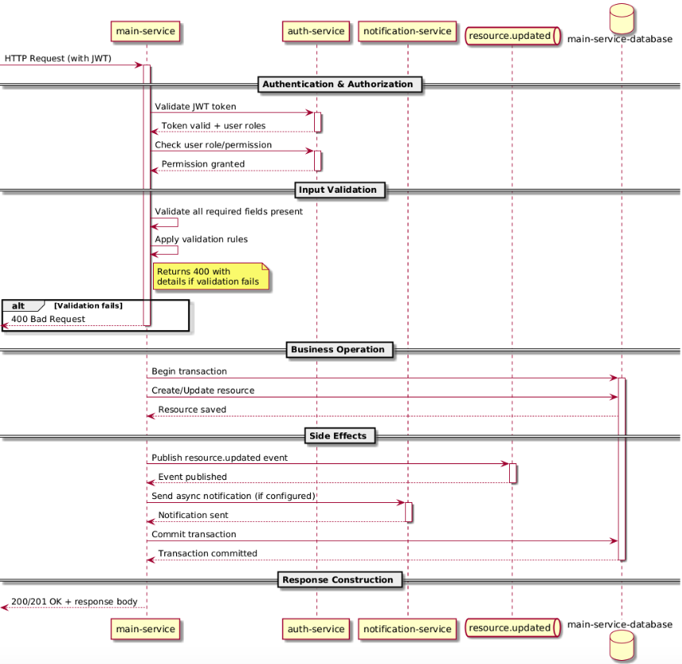

== {HTTP Method} /api/v1/resource
:source-highlighter: highlight.js
.Changelog
[%collapsible]
==== 
[cols="1,1,3", options="header"]
|===
| Date | Version | Description
| YYYY-MM-DD | 1.0 | Initial version
| YYYY-MM-DD | 1.1 | Added {some field}
|===
====

=== Status
[cols="1,2,2", options="header"]
|===
| Attribute | Value | Notes
| Method status | `draft` / `dev` / `stable` / `deprecated` / `archived` | **draft** - _not implemented yet_,
**dev** - _implementation in progress_, **stable** - _deployed to prod_, **deprecated** - _still works but scheduled for removal_, **archived** - _method existed but is no longer relevant_

| Deprecated Since | `vX.X.X` | If applicable, provide migration path
| Replacement | `{/api/v2/resource}` | Link to replacement API
|===

=== Description
Short description of what this method does, its purpose, and when to use it.

=== Request
[source,bash]
----
curl -X {HTTP_METHOD} "https://api.example.com{/api/v1/resource}" \
  -H "Authorization: Bearer {token}" \
  -H "Content-Type: application/json" \
  -d '{
    "field1": "value1",
    "field2": 123,
    "field3": null
  }'
----

[[target-id]]
=== Request Parameters
[cols="1,1,1,1,2,2", options="header"]
|===
| Parameter | Type | Required | Default | Description | Validation Rules
| `field1` | string | Yes | - | Description of field1 | Min length: 3, max: 100
| `field2` | integer | No | 1 | Description of field2 | Range: -1000 .. 1000
| `field3` | string | Conditional* | - | Required if field2 = 1 | Regex: ^[A-Z]{2,5}$
|===

=== Response (Success)
[source,json]
----
{
  "status": "success",
  "data": {
    "id": 12345,
    "field1": "value1",
    "createdAt": "2026-04-03T10:00:00Z"
  }
}
----

=== Response Parameters
[cols="1,1,1", options="header"]
|===
| Parameter | Description | Type
| `status` | Request execution status | string
| `data.id` | Unique identifier of created/updated resource | integer
| `data.field1` | Description of field1 | string
| `data.createdAt` | Timestamp of resource creation | string (ISO 8601)
|===

=== Response (Error)
[source,json]
----
{
  "status": "error",
  "code": 400,
  "message": "Invalid value for field 'field1'",
  "details": "field1 must be at least 3 characters"
}
----

=== Business Logic
. **Authentication & Authorization**
.. Validate JWT token from `Authorization` header
.. Check user has required role/permission
. **Input Validation**
.. Validate all required fields present
.. Apply validation rules from table <<target-id, Request Parameters>>
.. Return `400` with details if validation fails
. **Business Operation**
.. Perform core logic (e.g., create/update resource in database)
.. Execute within database transaction
. **Side Effects**
.. Publish Kafka event to `topic.resource.updated`
.. Send async notification (if configured)
. **Response Construction**
.. Build response DTO
.. Return `201`/`200` with response body

{blank} +

==== Sequence diagram

=== Prerequisites
[cols="1,2", options="header"]
|===
| Requirement | Description
| Authentication | JWT Bearer token with scope `read:resources`
| Authorization | Requires role `ADMIN` or `RESOURCE_MANAGER`
| Rate Limit | 100 requests per minute per API key
| Request Size Limit | Maximum payload size: 1 MB. Larger requests return 413 Payload Too Large
| Timeout | Service timeout: 30 seconds
|===

=== Additional Information
* **OpenAPI Specification:** [Link to Swagger/OpenAPI file]
* **Related Endpoints:** `GET /api/v1/resource` — list all resources, `GET /api/v1/resource/{id}` — get resource by id
* **Related Kafka Topics:** `resource.created`, `resource.updated`
* **Related gRPC Method:** `ResourceService.UpdateResource`
* **Rollback behavior:** Describe what happens on failure  
* **Contact:** Team @backend-team (Slack: #team-backend)

=== HTTP Status Codes
[%collapsible]
==== 
[cols="1,1,2", options="header"]
|===
| Code | Meaning | When to expect
| 200 | OK | Successful `GET`, `PUT`, `DELETE`, `PATCH`
| 201 | Created | Successful `POST` — resource created
| 202 | Accepted | Async operation accepted for processing
| 400 | Bad Request | Validation error or malformed request
| 401 | Unauthorized | Missing or invalid authentication
| 403 | Forbidden | Authenticated but insufficient permissions
| 404 | Not Found | Resource with specified ID does not exist
| 409 | Conflict | Idempotency key conflict or duplicate resource
| 413 | Payload too large | Requests larger than 1 MB
| 422 | Unprocessable Entity | Business logic violation 
| 429 | Too Many Requests | Rate limit exceeded
| 500 | Internal Server Error | Unexpected system error 
|===
==== 